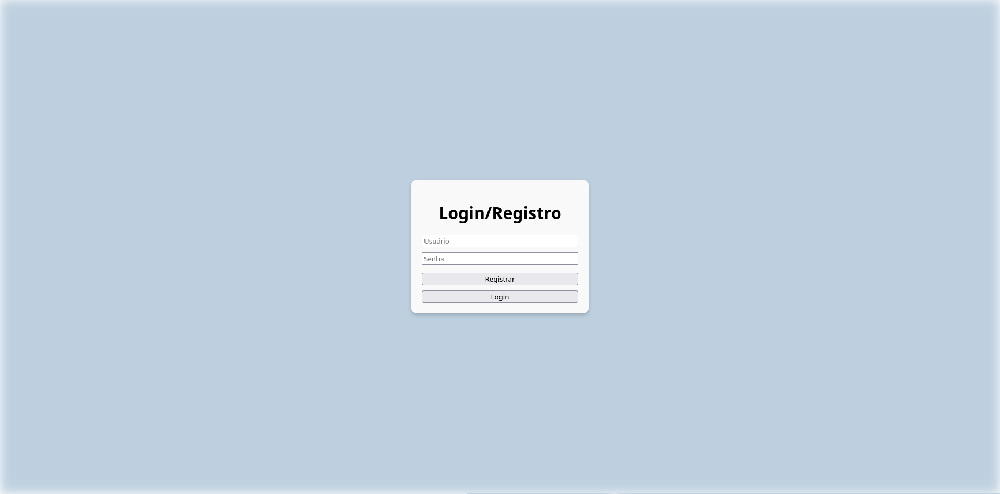
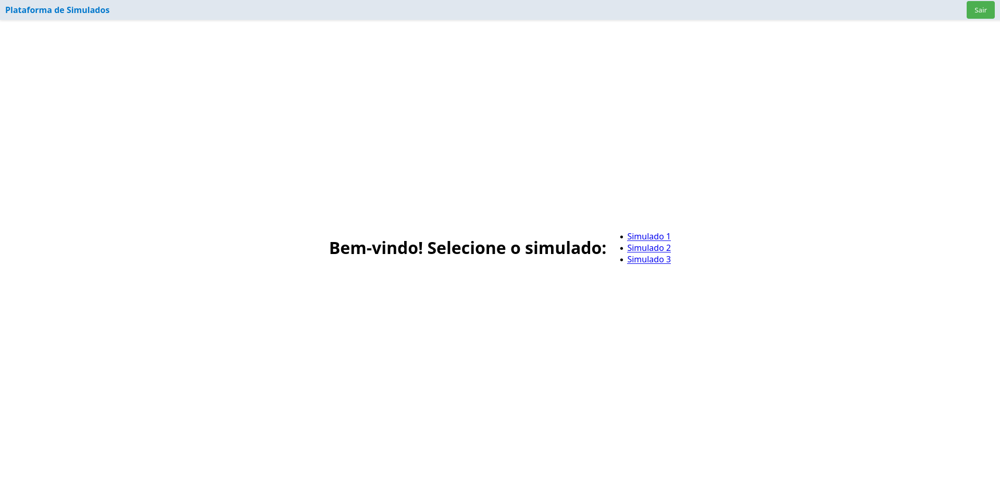

### Tarefa 1:

Dadas as restrições e necessidades do projeto, optei por utilizar duas ferramentas distintas para o banco de dados. A primeira, um banco SQL, será responsável por armazenar em tabelas os dados dos usuários e das questões, garantindo a integridade e a estrutura dos dados. Por outro lado, tendo em vista a necessidade de analisar o desempenho posteriormente, decidi que seria mais vantajoso utilizar uma ferramenta que facilite a manipulação e visualização dos dados. Assim, escolhi a biblioteca "pandas" em Python, que oferece recursos para análise e exploração dessas informações.

__Tables SQL:__

<table>
    <tr>
        <td>
            <table>
                <tr>
                    <th>user_id</th>
                    <th>username</th>
                    <th>password (hash)</th>
                </tr>
                <tr>
                    <td>1</td>
                    <td>joão_naruto123</td>
                    <td>****</td>
                </tr>
                <tr>
                    <td>2</td>
                    <td>pedro_gamer</td>
                    <td>****</td>
                </tr>
            </table>
        </td>
        <td>
            <table>
                <tr>
                    <th>question_id</th>
                    <th>question_text</th>
                    <th>answer</th>
                    <th>level</th>
                    <th>subject</th>
                </tr>
                <tr>
                    <td>1</td>
                    <td>Qual a capital da frança?</td>
                    <td>Paris</td>
                    <td>3</td>
                    <td>Geografia</td>
                </tr>
                <tr>
                    <td>2</td>
                    <td>A raiz de 144</td>
                    <td>12</td>
                    <td>8</td>
                    <td>Matematica</td>
                </tr>
            </table>
        </td>
    </tr>
</table>

__Tabela Pandas:__

<div style="text-align: center;">
    <table style="margin: 0 auto;">
        <tr>
            <th>user_id</th>
            <th>test_id</th>
            <th>question_id</th>
            <th>answer</th>
        </tr>
        <tr>
            <td>1</td>
            <td>101</td>
            <td>201</td>
            <td>Resposta A</td>
        </tr>
        <tr>
            <td>2</td>
            <td>102</td>
            <td>202</td>
            <td>Resposta B</td>
        </tr>
        <tr>
            <td>1</td>
            <td>103</td>
            <td>203</td>
            <td>Resposta C</td>
        </tr>
        <tr>
            <td>3</td>
            <td>101</td>
            <td>201</td>
            <td>Resposta D</td>
        </tr>
        <tr>
            <td>2</td>
            <td>104</td>
            <td>204</td>
            <td>Resposta E</td>
        </tr>
    </table>
</div>
<br>

Para garantir a escalabilidade do sistema à medida que o número de alunos, questões e resultados das provas cresce, considerar um banco de dados NoSQL, como o MongoDB, pode ser uma estratégia bastante eficaz. Esse tipo de banco de dados permite escalabilidade horizontal, o que facilita a adição de novos servidores para lidar com o aumento do volume de dados e consultas. Essa flexibilidade é fundamental para assegurar um bom desempenho à medida que a carga do sistema se intensifica.

### Tarefa 2

A partir dos dados já disponíveis no banco de dados, é possível montar provas distintas com base no número de questões por assunto e na dificuldade das questões. No entanto, o nível de dificuldade atualmente utilizado não considera a volatilidade que gostaríamos de introduzir nos testes. Portanto, seria interessante incluir um parâmetro de "range" de dificuldade. Essa abordagem permitiria que, em uma prova com dificuldade média 5 e um range de 4, questões de nível 1 até nível 9 fossem incluídas. Por outro lado, um range de 2 resultaria em questões mais equilibradas, próximas ao nível 5. Essa flexibilidade contribuiria para uma avaliação mais dinâmica e diversificada das habilidades dos alunos.

Nesse sentido, ficaria a cargo do educador decidir os parâmetros desejados, escolhendo o número de questões por assunto, a dificuldade média e a volatilidade das questões. Em seguida, um algoritmo deve selecionar aleatóriamente as questões que atendem tais parâmetros no banco de dados. Um exemplo desse algoritmo pode ser:

```python
def create_provas(medium_lvl, selected_subjects):
    prova = []

    for subject, per_subject in selected_subjects.items():
        conn = get_db_connection()
        questions = conn.execute('SELECT * FROM Questions WHERE subject = ?', (subject,)).fetchall()
        conn.close()
        
        filtered_questions = [q for q in questions if medium_lvl - 1 <= q['lvl'] <= medium_lvl + 1] # aqui é utilizado o parâmetro do "range"
        
        if not filtered_questions:
            filtered_questions = questions
        
        num_to_select = min(per_subject, len(filtered_questions))
        
        if num_to_select == 0:
            raise ValueError(f"No questions available for subject: {subject}")
        selected_questions = random.sample(filtered_questions, num_to_select)
        
        prova.extend(q['id'] for q in selected_questions)
    
    return prova
```

### Tarefa 3

Uma vez que os dados foram armazenados em um arquivo .csv pelo pandas, torna-se fácil realizar qualquer análise usando Python e numpy, que é uma ótima ferramenta para lidar com grandes volumes de dados. Essa abordagem permite até mesmo a aplicação de técnicas de machine learning, entre outras possibilidades. Além disso, os dados podem ser facilmente manipulados no Excel, proporcionando uma forma acessível de realizar análises e visualizações de maneira intuitiva e prática. Exemplo de utilização do Python para o rpb:

```python
import numpy as np

def calcular_rpb(notas_acertos, notas_erros):
    # Cálculo das médias
    X1 = np.mean(notas_acertos) if notas_acertos else 0  # Média das notas dos que acertaram
    X0 = np.mean(notas_erros) if notas_erros else 0      # Média das notas dos que erraram
    
    # Cálculo do desvio padrão
    SX = np.std(notas_acertos + notas_erros)             # Desvio padrão das notas
    
    # Cálculo das proporções
    p1 = len(notas_acertos) / (len(notas_acertos) + len(notas_erros)) if (len(notas_acertos) + len(notas_erros)) > 0 else 0
    p0 = len(notas_erros) / (len(notas_acertos) + len(notas_erros)) if (len(notas_acertos) + len(notas_erros)) > 0 else 0

    # Cálculo de rpb
    rpb = X1 - X0 / (SX * (p1 * p0) / p1)
    
    return rpb

# Exemplo de uso
notas_acertos = [7, 8, 9, 10]
notas_erros = [3, 4, 5]

resultado = calcular_rpb(notas_acertos, notas_erros)
print("O valor de rpb é:", resultado)

```

### Tarefa 4

Visando a acessibilidade para os alunos, optei pela criação de um site, uma solução que garante portabilidade em qualquer dispositivo e assegura uma aplicação leve, capaz de rodar em dispositivos mais modestos. A interface será composta por três páginas principais: a página de login/registro, onde os alunos precisam criar uma conta para coletar seus dados; a "Home", onde poderão escolher o simulado que desejam realizar; e a página de realização da prova, que exibirá as questões em caixas, com as alternativas em múltipla escolha. Além disso, tanto nas páginas "Home" quanto "Provas", haverá uma barra de navegação que permitirá aos usuários realizar logout de maneira fácil e rápida.





### Tarefa 5

A fim de produzir o site, foi escolhid o Flask - Framework em python - para realizar o backend. Além disso, as ferramentas citadas anteriormente nesse relatório também foram utilizada. Para o frontend foi utilizado o React, como solicitado. O aplicativo esta contido nesse repositório na pasta app. Caso deseje testar o programa e tenha o gerenciador de ambiente "Nix", basta rodar os seguintes comandos no terminal:

```bash
cd app
nix develop  --experimental-features 'nix-command flakes'
cd backend/app
python3 main.py &
cd ../../frontend
npm start
 ```

A partir disso, basta acessar o site em http://localhost/3000/.

A fins de apresentação segue o vídeo:

<iframe width="560" height="315" src="https://www.youtube.com/embed/AvYUiGij8gQ" frameborder="0" allowfullscreen></iframe>

https://youtu.be/AvYUiGij8gQ